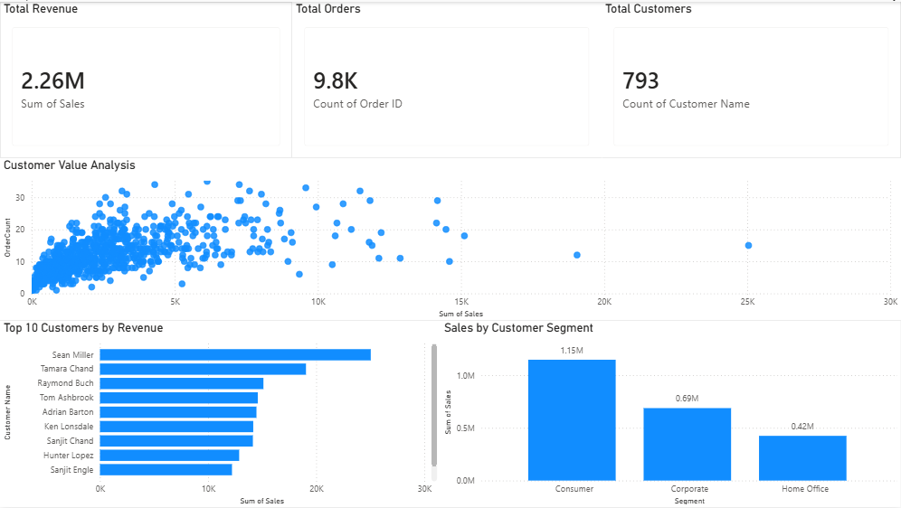

## 📊 Customer Revenue Analysis Dashboard

This project analyzes customer behavior and revenue performance using Excel and Power BI.

### 🔧 Tools Used
- Excel (data cleaning & transformation)
- Power BI (dashboard creation & visualization)

### 📈 Key Insights
- A small group of customers generates a large portion of total revenue
- Most customers have low sales and low order frequency
- High-value customers can be identified through sales vs order patterns
- Consumer segment generates the highest revenue compared to other segments

### 📊 Dashboard Features
- KPI cards for Total Revenue, Total Orders, and Total Customers
- Top 10 Customers by Revenue
- Customer Value Analysis (scatter plot of sales vs order count)
- Sales by Customer Segment

### 📷 Dashboard Preview

